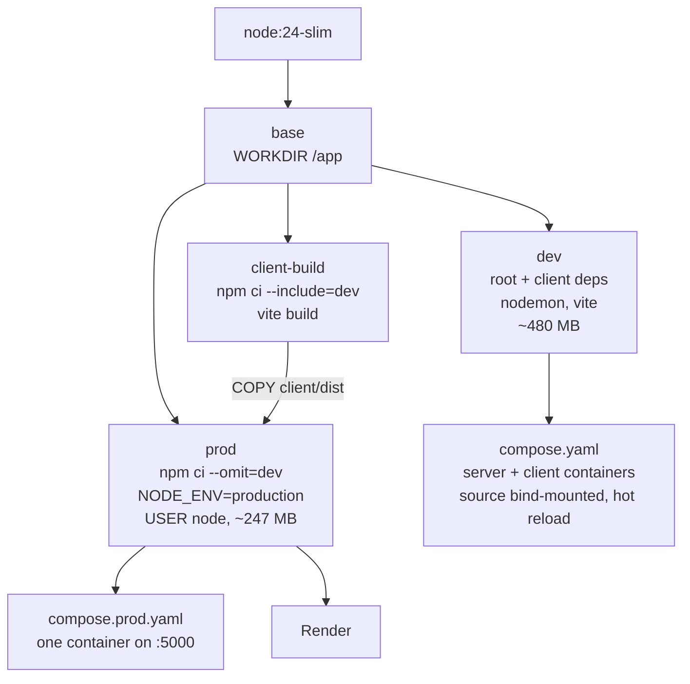
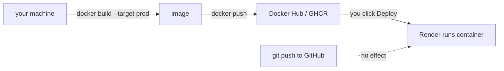
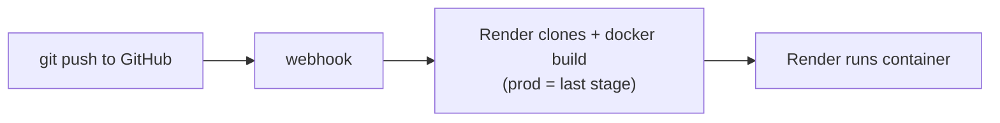

# Running Contact Keeper in Docker

Two stacks are provided. Both bring their own MongoDB, so nothing needs to be
installed on the host beyond Docker itself.

| | File | What runs | Where |
| --- | --- | --- | --- |
| **Development** | `compose.yaml` | Mongo + API (nodemon) + Vite dev server | client on :5173, API on :5000 |
| **Production** | `compose.prod.yaml` | Mongo + one container serving API *and* the built client | everything on :5000 |

## How it fits together

One [Dockerfile](Dockerfile), four stages. `dev` is what you run locally; `prod`
is what ships. They share a base but are otherwise independent — `prod` never
contains nodemon, Vite, or any devDependency.



The split is why the client bundle exists in production without Vite being
installed there: `client-build` compiles it in a throwaway stage, and `prod`
copies only the finished `client/dist` out of it.

Locally, the three dev containers talk over a Compose network by service name:

```
browser :5173 ──► client (Vite)  ──proxy /api──►  server (Express) ──►  mongo
                                 http://server:5000        mongodb://mongo:27017
```

That is why [client/vite.config.js](client/vite.config.js) reads
`API_PROXY_TARGET` — inside Docker the API is not on `localhost`.

### Deploying: two paths, only one auto-deploys

**Path A — you build and push the image.** Render pulls a tag from a registry.
A `git push` does nothing on its own; the image is what Render watches, and
nothing rebuilds it but you.



**Path B — Render builds the Dockerfile.** A push to `master` triggers a build
on Render's side. Same `prod` stage, same resulting container; the build just
happens there instead of on your machine.



Both paths reach the same place. Path B is the one that behaves like the
GitHub deploys you are used to; Path A trades that for controlling exactly
which image bits ship.

To get auto-deploy while still building the image yourself, keep Path A and add
a **Deploy Hook** (a URL Render gives you that triggers a redeploy when POSTed
to). A GitHub Actions workflow — or a Docker Hub webhook — can call it after
the image is pushed.

## Prerequisites

- Docker Desktop (Compose v2.24+ — `docker compose version`)
- A `.env` file in the project root containing `JWT_SECRET`

`.env` is the only setup step. Compose reads `JWT_SECRET` from it and supplies
`MONGO_URI` itself, pointing at the Mongo container:

```bash
cp .env.example .env
```

Then **uncomment `JWT_SECRET` and give it a value** — `.env.example` ships with
it commented out, and `config/env.js` refuses to boot without it. You can leave
`MONGO_URI` as-is; both stacks override it.

If `.env` is missing or incomplete, the container exits immediately and the log
names the variables it wanted. That is `config/env.js` doing its job, not a
Docker problem.

## Development

```bash
docker compose up --build        # first run, or after changing a Dockerfile
docker compose up -d             # subsequent runs, detached
```

Open **http://localhost:5173**. Register an account and the app works
end to end.

The source tree is bind-mounted into both app containers, so hot reload works
from your normal editor on Windows:

- editing `server.js`, `routes/`, `controllers/`, … restarts nodemon
- editing anything under `client/src/` triggers a Vite HMR update

Both use polling rather than filesystem events, because inotify does not
propagate across a Windows bind mount. That is why `compose.yaml` runs
`nodemon -L` and sets `VITE_USE_POLLING=true`.

Everyday commands:

```bash
docker compose logs -f server    # follow the API log
docker compose logs -f client    # follow the Vite log
docker compose ps                # health and port mapping
docker compose restart server    # restart just the API
docker compose down              # stop; the database volume survives
docker compose down -v           # stop and delete the database
```

### Adding a dependency

`node_modules` lives inside the image, not in the bind mount, so installing on
the host is not enough — rebuild:

```bash
npm install <pkg>                        # updates package.json + lockfile
docker compose up -d --build server      # or --build client for a client dep
```

## Production

```bash
docker compose -f compose.prod.yaml up --build -d
```

Open **http://localhost:5000** — Express serves the API and the client bundle
from a single origin, using the `NODE_ENV=production` branch in `server.js`.
Deep links like `/login` work through the SPA fallback route.

The image is multi-stage: the client is built in a throwaway stage and only
`client/dist` is copied into the runtime layer, which installs `--omit=dev` and
runs as the non-root `node` user (~247 MB versus ~480 MB for the dev image).

```bash
docker compose -f compose.prod.yaml logs -f app
docker compose -f compose.prod.yaml down
```

The two stacks use different Compose project names, so the production database
volume is separate from the development one and starts empty. Mongo is not
published to the host here — only the app container can reach it.

## Using MongoDB Atlas instead of the Mongo container

Comment out the `MONGO_URI` line under `environment:` in whichever compose file
you are using. The value from `.env` then takes over:

```yaml
    environment:
      NODE_ENV: development
      PORT: '5000'
      # MONGO_URI: mongodb://mongo:27017/contact-keeper
```

You can also drop the `mongo` service and its `depends_on` block, though
leaving them running is harmless. Atlas requires your current IP in its Network
Access allowlist — the request leaves from the host, not the container.

## Connecting a GUI to the development database

The development stack publishes Mongo on the standard port, so Compass or
`mongosh` connects with:

```
mongodb://localhost:27017
```

## Notes

- **The database is named `dev-db`, not `contact-keeper`.** `config/db.js`
  hardcodes `dbName: 'dev-db'`, which overrides the path segment in any
  `MONGO_URI` — so the startup log reads `MongoDB connected — db: dev-db` in
  both stacks. This is a known issue with a spec attached
  ([Spec 04 / T4](features/04-tooling.md)); it is not caused by the Docker
  setup, and the app works normally.
- **Port already in use.** Both stacks publish :5000. Stop one before starting
  the other, or stop any `npm run dev` running on the host.
- **`.env` is excluded from the image** via `.dockerignore`. Secrets reach the
  containers as runtime environment variables only, never baked into a layer.
- **The healthcheck probes `/`**, since the API has no `/health` route yet. It
  reports the process as serving, not that Mongo is reachable.
